# Q4

## Learning Time

### Learning Time vs Number of Samples (N)

#### Real Input Real Output

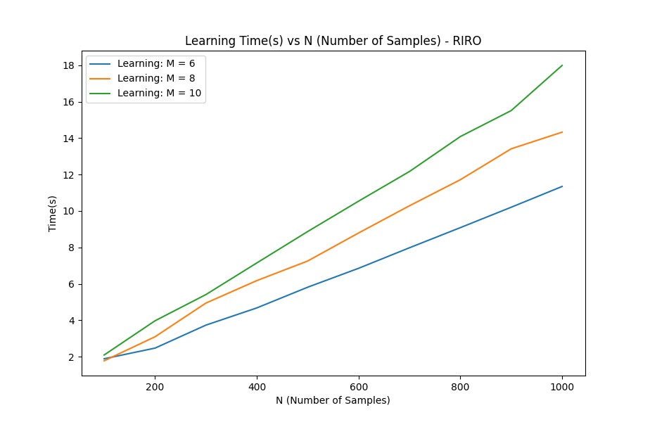

#### Real Input Discrete Output

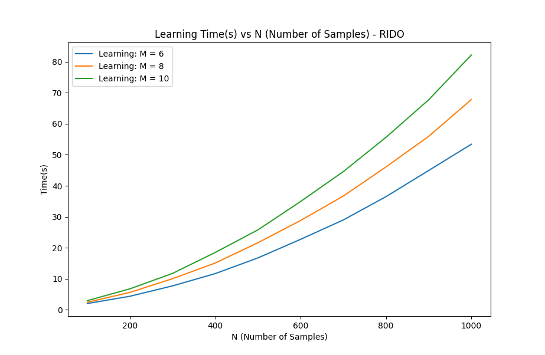

#### Discrete Input Discrete Output

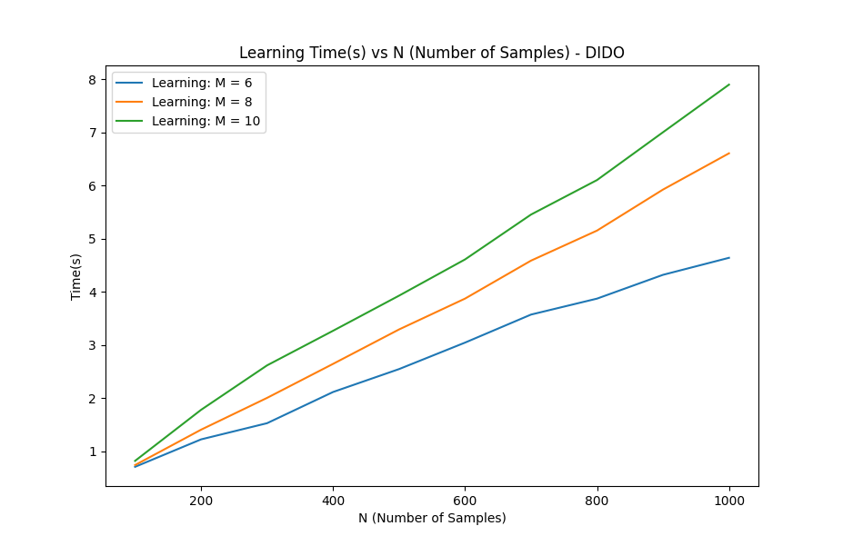

#### Discrete Input Real Output

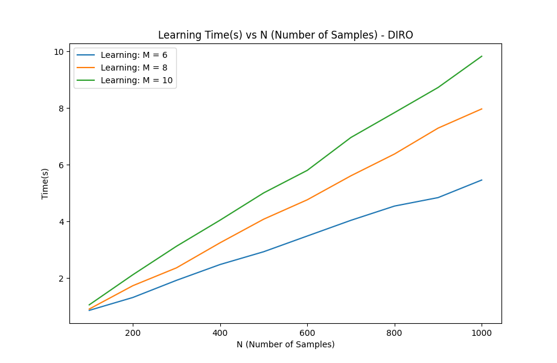

### Learning Time vs Number of Features (M)

#### Real Input Real Output

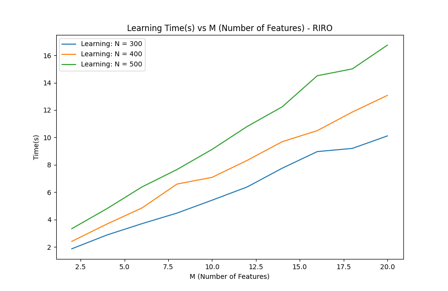

#### Real Input Discrete Output

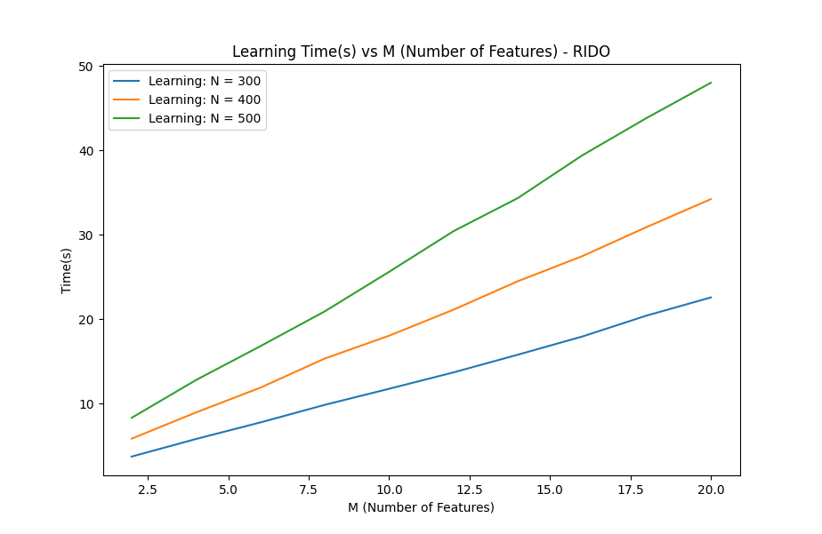

#### Discrete Input Discrete Output

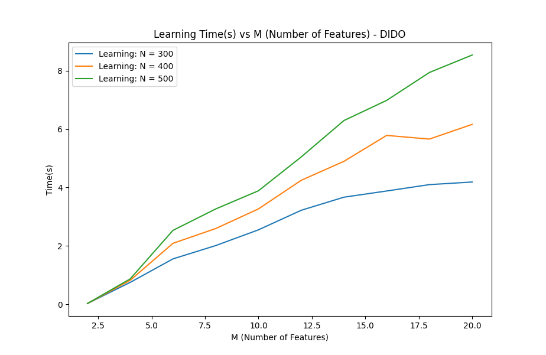

#### Discrete Input Real Output

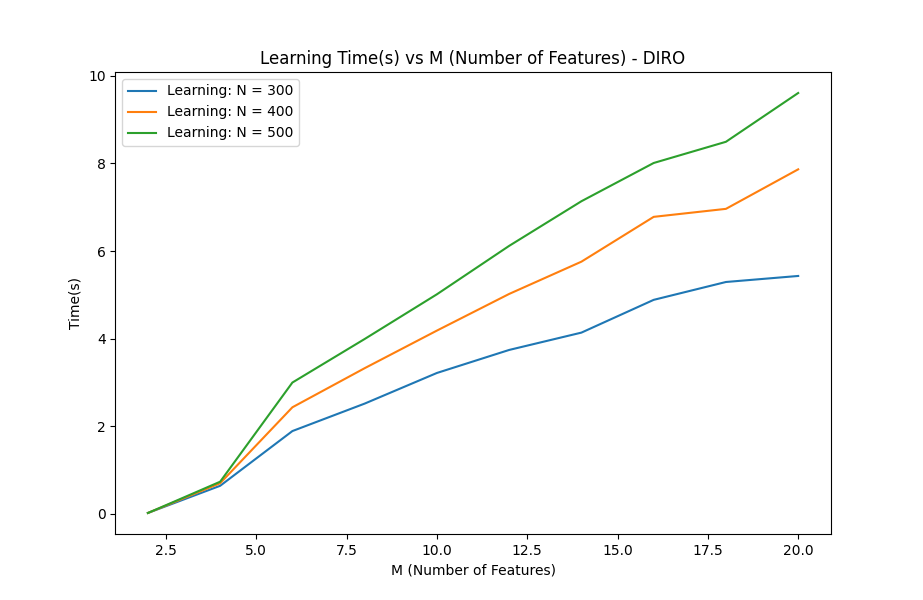

## Comparison of observed learning time with theoretical learning time

The theoretical time complexity of the learning algorithm of a decision tree is **O(NMD)** where **N** is the number of samples, **M** is the number of features and **D** is the depth of the tree created. **D** is often considered to be **log(N)** on average, leading to an average time complexity of **O(NMlog(N))**. Since I have fixed a max-depth in my experiments, we can consider **D** to be constant, leading to a theoretical time complexity of **O(NM)**. From the **Learning Time vs N plots**, I observed that learning time was linear with respect to **N**, and from the **Learning Time vs M plots**, I observed that learning time was linear with respect to **M**. Thus, my observations agreed with theoretical complexity for learning time(in all 4 cases).

## Prediction Time

### Prediction Time vs Number of Samples (N)

#### Real Input Real Output

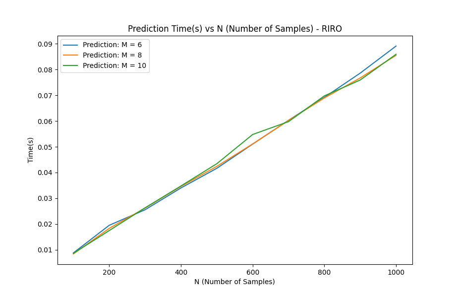

#### Real Input Discrete Output

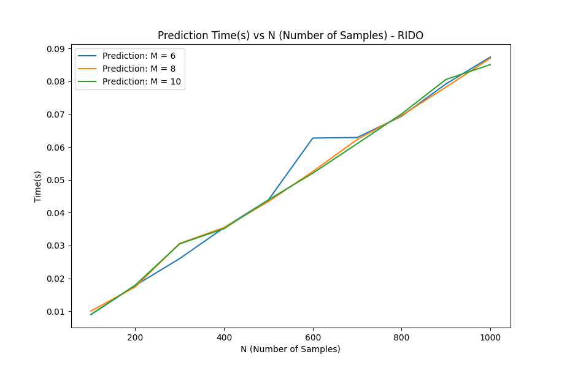

#### Discrete Input Discrete Output

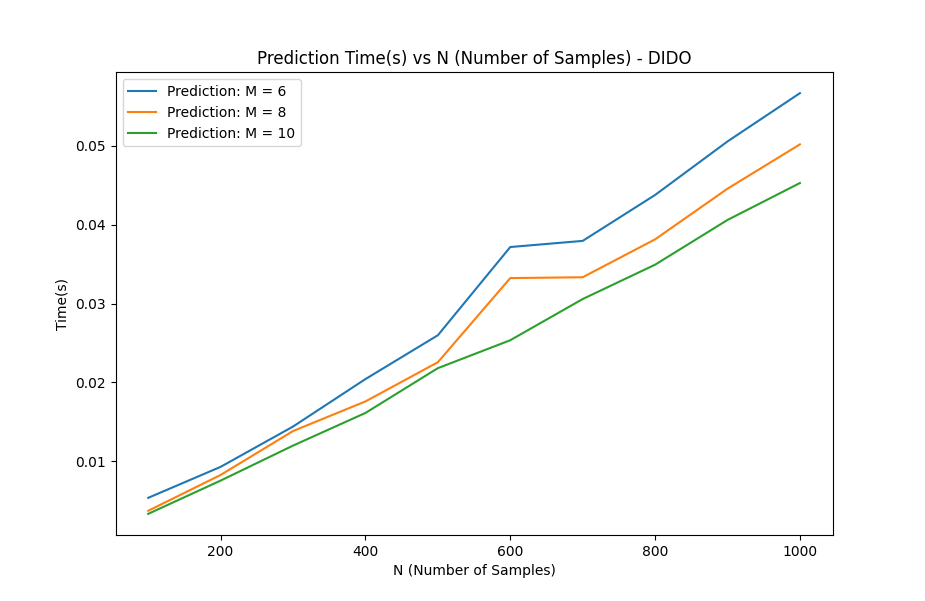

#### Discrete Input Real Output

### Prediction Time vs Number of Features (M)

#### Real Input Real Output

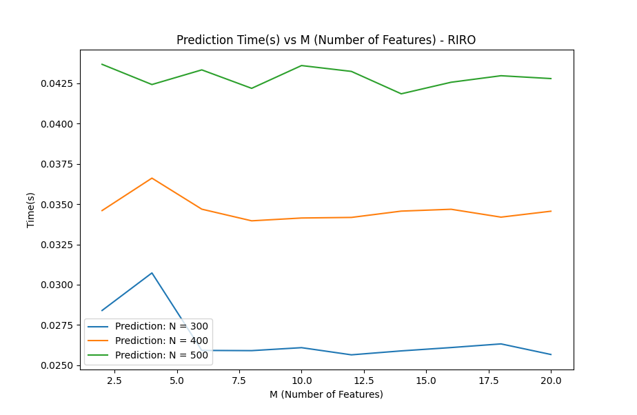

#### Real Input Discrete Output

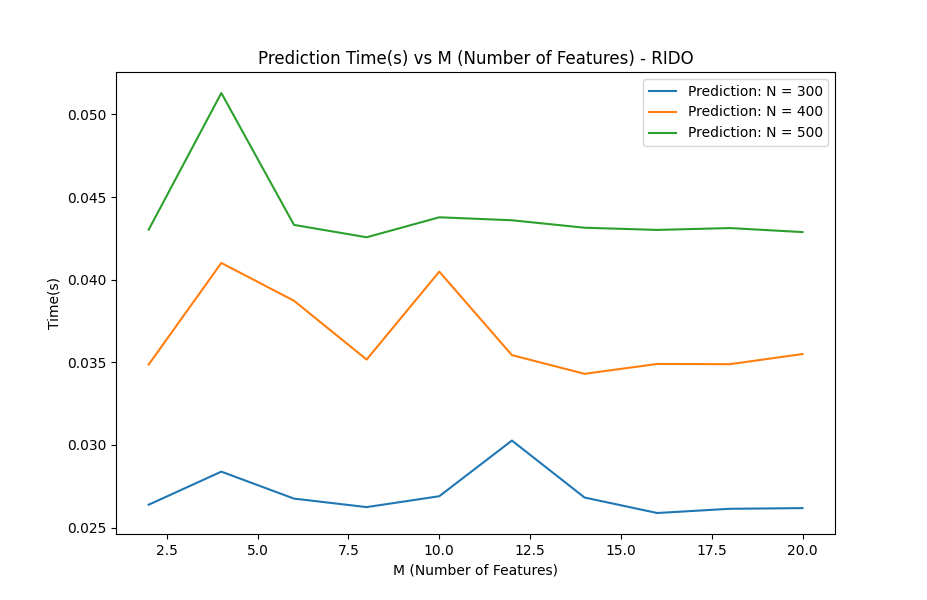

#### Discrete Input Discrete Output

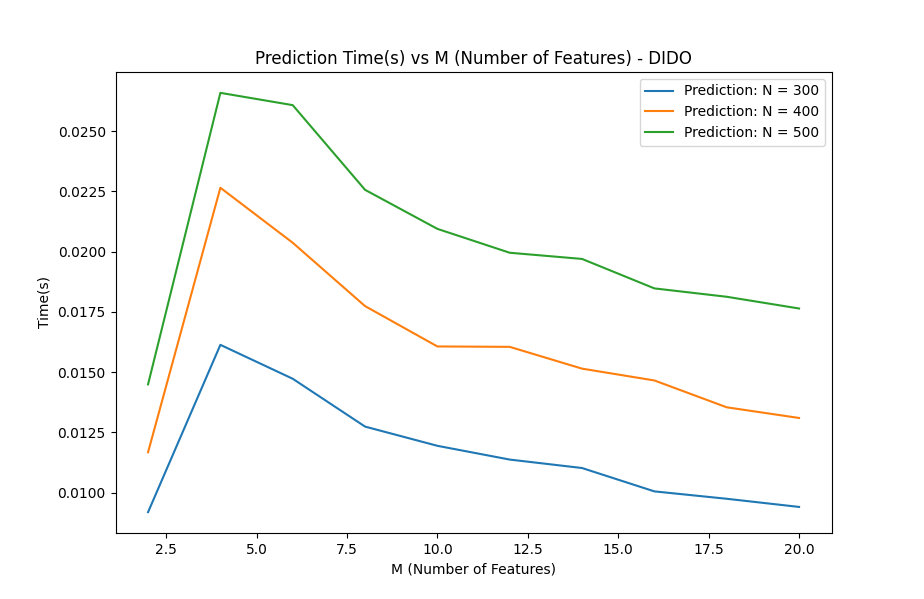

#### Discrete Input Real Output

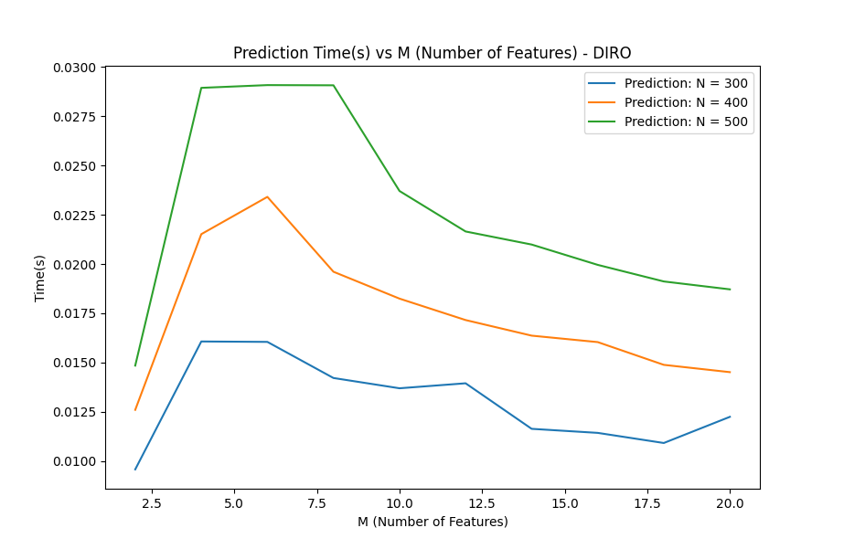

## Comparison of observed learning time with theoretical learning time

The theoretical time complexity of the prediction algorithm of a decision tree is **O(ND)** where **N** is the number of samples, and **D** is the depth of the tree created. **D** is often considered to be **log(N)** on average, leading to an average time complexity of **O(Nlog(N))**. Since I have fixed a max-depth in my experiments, we can consider **D** to be constant, leading to a theoretical time complexity of **O(N)**. From the **Prediction Time vs N plots**, I observed that prediction time was linear with respect to **N**(for all 4 cases), and from the **Prediction Time vs M plots**, I observed that prediction time was constant with respect to **M** for 2 cases(RIRO, RIDO) and slightly complicated for 2 cases(DIRO, DIDO). It could be due to my depth limit or some other optimisation in the code. Thus, my observations agreed with theoretical complexity for prediction time(in most cases: 6 out of 8 plots).
