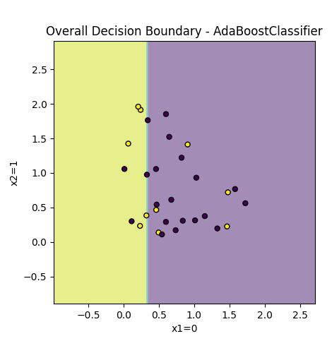

# Q5

## 5a - Decision boundaries for fake dataset used to test AdaboostClassifier

### Decision boundaries of individual estimators

### Overall decision boundary

## 5b - Decision boundaries for IRIS dataset

### Decision boundaries of individual estimators

### Overall decision boundary

