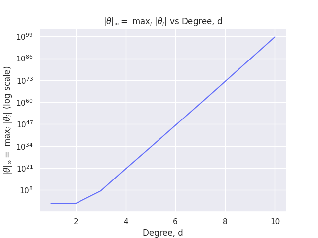

# ES654-2020-21 Assignment 2

*Chris Francis* - *18110041*

------
**Note:** I have used seaborn for styling the matplotlib plots. It can be installed using `pip install seaborn`

## Plot

## Conclusion

* On increasing the degree, the maximum coefficient(magnitude) also increases. 

* The above observation can be reasoned as follows: On increasing the degree, the model is able to fit more points in the training dataset correctly. This leads to over-fitting which is also called high-variance, since a small change in the dataset can cause a large change in the model. In other words, overfitting means that the model is overstating the impact of a given set of feature on the response, and the impact of a feature is determined by the coefficient corresponding to it. Thus, the coefficients learnt are larger.
