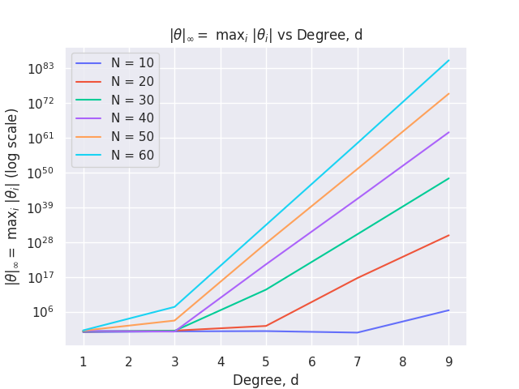

# ES654-2020-21 Assignment 2

*Chris Francis* - *18110041*

------
**Note:** I have used seaborn for styling the matplotlib plots. It can be installed using `pip install seaborn`

## Plot

## Conclusion

* Increasing the degree(d) leads to an increase in the maximum coefficient(magnitude) as seen earlier in q5.

* Increasing the number of samples(N) leads to an increase in the maximum coefficient(magnitude).

* The above observation can be reasoned as follows: As we increase the number of samples, the model tries to accurately fit all these points and this leads to increase in the magnitude of the coefficients. However, this is not the case always and can depend on the nature of the dataset. 
