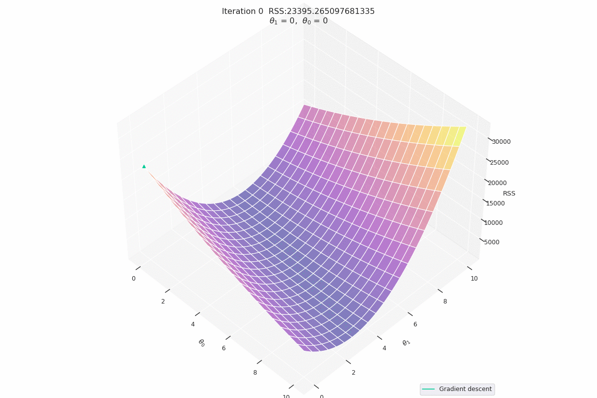
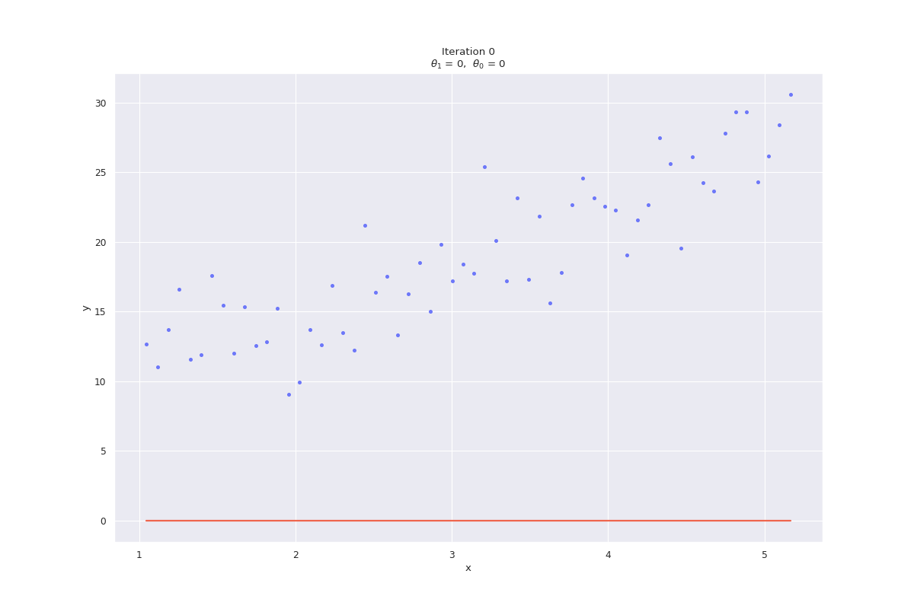
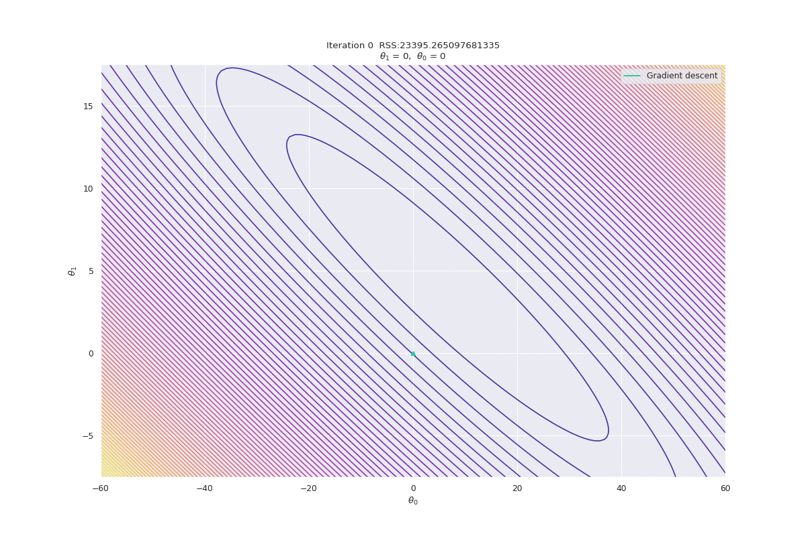

# ES654-2020-21 Assignment 2

*Chris Francis* - *18110041*

------
**Note:** I have used seaborn for styling the matplotlib plots. It can be installed using `pip install seaborn`

## Surface Plots

### Constant Learning Rate

### Inverse Learning Rate

## Line-fit Plots

### Constant Learning Rate

### Inverse Learning Rate

## Contour Plots

### Constant Learning Rate

### Inverse Learning Rate

