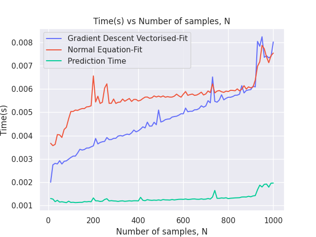
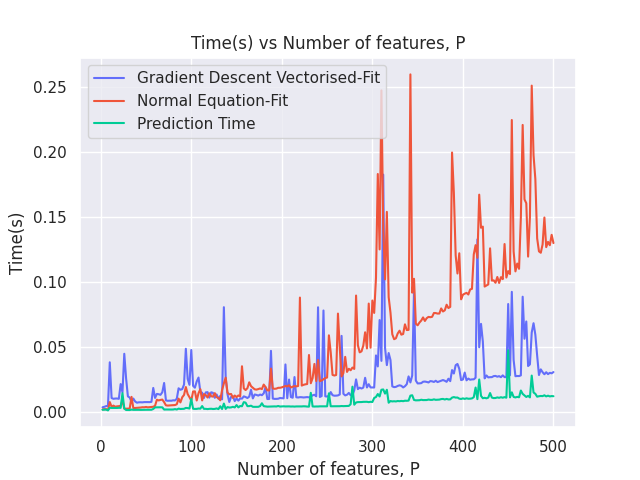
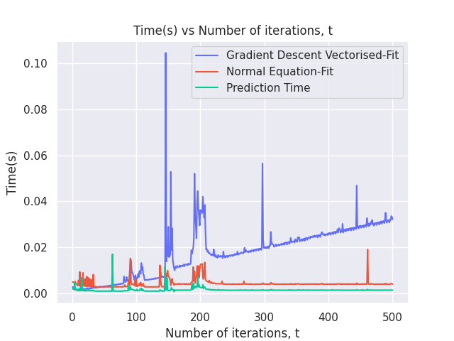

# ES654-2020 Assignment 3

*Chris Francis* - *18110041*

------
**Note:** I have used seaborn for styling the matplotlib plots. It can be installed using `pip install seaborn`

## Theoretical time complexity

* Theoretical time complexity of linear regression learning using vectorised gradient descent(for my implementation) is **O(NPt)**, where N is the number of samples, P is the number of features and t is the number of iterations. Thus, we expect the time taken for linear regression learning using vectorised gradient descent to be linear with respect to N, P and t.

* Theoretical time complexity of linear regression learning using normal equation is **O(P3 + P2N)**, where N is the number of samples, P is the number of features. Thus, we expect the time taken for linear regression learning using normal equation to be linear with respect to N, cubic with respect to P and constant with respect to t. 

* Theoretical time complexity of linear regression prediction is **O(NP)**, where N is the number of samples, P is the number of features. Thus, we expect the time taken for linear regression prediction to be linear with respect to N, linear with respect to P and constant with respect to t. 

## Plots

In this plot, we can see that all three quantities are approximately linear with respect to N, though their slopes are very different.

In this plot, we can see that gradient descent method is approximately linear with respect to P, normal equation method appears to be growing faster than linear with respect to P, and that the prediction time is approximately linear with respect to P.

In this plot, we can see that gradient descent method is approximately linear with respect to t, while normal equation method and prediction time are approximately constant with respect to t.

## Conclusion

* Thus, we observe that the time taken matches with the expected theoretical trends except for a few outliers. 
